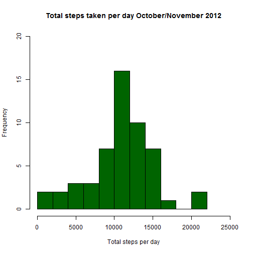
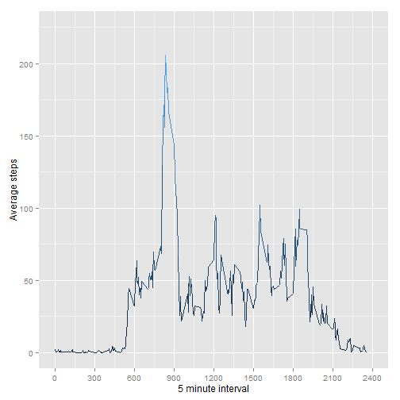
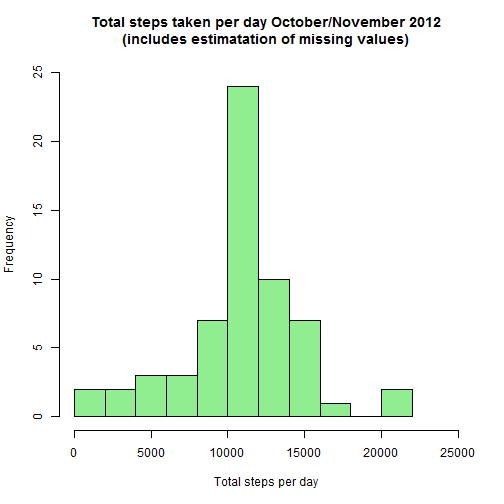
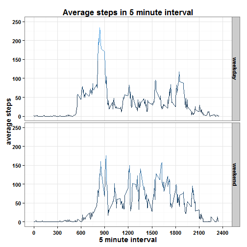

# Reproducible Research Assignment1


## Data

Read data from file activity.csv


```r
data <- read.csv("./repdata-data-activity/activity.csv", stringsAsFactors = FALSE)
head(data)
```

```
##   steps       date interval
## 1    NA 2012-10-01        0
## 2    NA 2012-10-01        5
## 3    NA 2012-10-01       10
## 4    NA 2012-10-01       15
## 5    NA 2012-10-01       20
## 6    NA 2012-10-01       25
```


## Calculate total steps per day

Calculate the total steps per day and show the results on a histogram. 


```r
library(dplyr)

totstepsdata <- data %>% 
    na.omit() %>% 
    group_by(date) %>% 
    summarize(totsteps = sum(steps))

hist(totstepsdata$totsteps, main = "Total steps taken per day October/November 2012", 
     ylim = c(0, 20), 
     xlim = c(0, 25000), xlab = "Total steps per day", col = "darkgreen",
     breaks = 11)
```

 


Total number of steps **mean**: 10766.19

Total number of steps **median**: 10765


## Average daily activity pattern

Calculate the average number of steps taken, averaged across all days.


```r
library(ggplot2)

averagedailydata <- data %>% 
    na.omit() %>% 
    group_by(interval) %>% 
    summarize(avractivity = mean(steps))
```

Create a time series plot.


```r
qplot(data = averagedailydata, interval, avractivity, color = avractivity, geom="line") +
    scale_y_continuous("Average steps", limits=c(0,225),breaks=seq(0, 225, 50)) + 
    scale_colour_continuous(guide = FALSE) +
    scale_x_continuous("5 minute interval", limits=c(0,2400),breaks=seq(0, 2400, 300))
```

 


5 minutes interval with **maximum** average steps across all days: 8 hours and 35 minutes


## Missing values

The total number of missing values in the dataset is 2304.

In order to fill in the missing values in the dataset (only applies to the steps variable) we will use the average number of steps across all days for the same time interval.


```r
missingdata <- data %>%
    merge(averagedailydata) %>%
    mutate(steps = ifelse(is.na(steps), round(avractivity, 0), steps)) %>%
    select(-avractivity) %>%
    arrange(date, interval)
```

Create a histogram.


```r
totstepsdata <- missingdata %>% 
    na.omit() %>% 
    group_by(date) %>% 
    summarize(totsteps = sum(steps))

hist(totstepsdata$totsteps, 
     main = "Total steps taken per day October/November 2012\n(includes estimatation of missing values)", 
     ylim = c(0, 25), 
     xlim = c(0, 25000), xlab = "Total steps per day", col = "lightgreen",
     breaks = 11)
```

 


Total number of steps **mean** (includes estimation for missing values): 10765.64

Total number of steps **median** (includes estimation for missing values): 10762

The values of the mean and the median don't differ much from the first analysis (ignoring the missing values). That implies that the method to estimate the missing values is good.


## Different patterns between weekdays and weekends


```r
library(lubridate)

weekdata <- mutate(data, 
    weekday = ifelse(weekdays(ymd(date)) == 'Sunday' | weekdays(ymd(date)) == 'Saturday', "weekend", "weekday"))

weekdata$weekday <- factor(weekdata$weekday)

weekdata <- weekdata %>% 
    na.omit() %>%
    group_by(interval, weekday) %>% 
    summarize(avrsteps = round(mean(steps), 0))
```

Create the panel plot containing a time series plot of the 5 minute interval and the
average number of steps taken, averaged across all weekday days or weekend days


```r
ggplot(data=weekdata, aes(interval, avrsteps)) + 
    geom_line(aes(colour = avrsteps)) +  
    scale_fill_hue(name ="weekday", h=c(0, 90)) +
    theme_bw() +
    theme(text = element_text(size=14, face = "bold")) +
    facet_grid(weekday ~ .)  +
    scale_colour_continuous(guide = FALSE) +
    scale_y_continuous("average steps", limits=c(0,250),breaks=seq(0, 250, 50)) + 
    scale_x_continuous("5 minute interval", limits=c(0,2400),breaks=seq(0, 2400, 300)) + 
    ggtitle("Average steps in 5 minute interval")
```

 

In the plot we can appreciate how during the weekday days there is a peak before 
9 am however during the weekend this doesn't happen.
